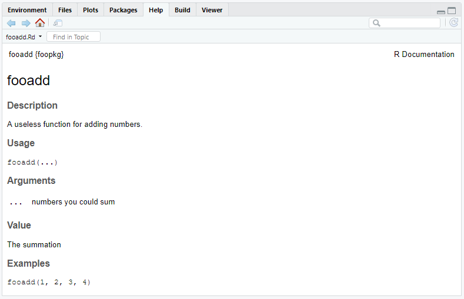

```{r setup, include=FALSE}
knitr::opts_chunk$set(echo = TRUE, eval = FALSE)
```

## A little background

An introductory slide deck can be found [here](https://speakerdeck.com/ntwilliams/making-an-r-package).

## Creating the initial package

To get setup, we can first check to see if the `devtools`, `usethis`, and `glue` packages are installed and if not install them. 

```{r eval = FALSE}
pkg <- c("devtools", "usethis", "glue")

lapply(pkg, require, character.only = TRUE)
```

*devtools* is your biggest friend when making a package, it is full of helper functions that speed up the development process. Once we have devtools loaded, we can use it to create the skeleton of the package. But first, you need to decide the most important aspect of your package, it's name. 

In this case, we will name our package *foopkg*. To create the package we call `create_packages()` and specify where to create the project for the package on the computer. 

```{r}
create_package("~/Documents/foopkg")
```

I'm creating a project in the "Documents" folder on my computer. If you want to save the package in a different folder just modify the filepath. You should get an output similar to this and a new R project should open up in a new window. 

```{r}
✔ Creating 'C:/Users/niwi8/Documents/foopkg/'
✔ Setting active project to 'C:/Users/niwi8/Documents/foopkg'
✔ Creating 'R/'
✔ Writing 'DESCRIPTION'
Package: foopkg
Title: What the Package Does (One Line, Title Case)
Version: 0.0.0.9000
Authors@R (parsed):
    * First Last <first.last@example.com> [aut, cre] (<https://orcid.org/YOUR-ORCID-ID>)
Description: What the package does (one paragraph).
License: What license it uses
Encoding: UTF-8
LazyData: true
✔ Writing 'NAMESPACE'
✔ Writing 'foopkg.Rproj'
✔ Adding '.Rproj.user' to '.gitignore'
✔ Adding '^foopkg\\.Rproj$', '^\\.Rproj\\.user$' to '.Rbuildignore'
✔ Opening 'C:/Users/niwi8/Documents/foopkg/' in new RStudio session
✔ Setting active project to '<no active project>'
```

If you use version control, now would also be a good time to create a git repository for your new package (I'm not going to here, but you should really do this if working on a real package). *devtools* is nice and has a function to do just this.

```{r}
use_git()
```

Before we go any further, we should also add a license. Making an R package is a lot of work and it is important to take ownership of what you create. An MIT License is the best way to go if you want other people to be able to use your package and its code with the only restriction that any further distribution of the package also includes the license. 

```{r}
use_mit_license("Your name here")
```

Two new files should be added to your package folder. If you open the .md file you should see a license identical to this one but with your name instead. 

```{}
# MIT License

Copyright (c) 2019 Nick Williams

Permission is hereby granted, free of charge, to any person obtaining a copy
of this software and associated documentation files (the "Software"), to deal
in the Software without restriction, including without limitation the rights
to use, copy, modify, merge, publish, distribute, sublicense, and/or sell
copies of the Software, and to permit persons to whom the Software is
furnished to do so, subject to the following conditions:

The above copyright notice and this permission notice shall be included in all
copies or substantial portions of the Software.

THE SOFTWARE IS PROVIDED "AS IS", WITHOUT WARRANTY OF ANY KIND, EXPRESS OR
IMPLIED, INCLUDING BUT NOT LIMITED TO THE WARRANTIES OF MERCHANTABILITY,
FITNESS FOR A PARTICULAR PURPOSE AND NONINFRINGEMENT. IN NO EVENT SHALL THE
AUTHORS OR COPYRIGHT HOLDERS BE LIABLE FOR ANY CLAIM, DAMAGES OR OTHER
LIABILITY, WHETHER IN AN ACTION OF CONTRACT, TORT OR OTHERWISE, ARISING FROM,
OUT OF OR IN CONNECTION WITH THE SOFTWARE OR THE USE OR OTHER DEALINGS IN THE
SOFTWARE.
```

## Adding functions

Making a package requires you to have functions within the package to actually use. We won't go over writing functions here, but there are plenty of resources online if you need help. 

The code for package functions should be stored in the R folder of the project directory. It is good practice to save the file name as the name of the function itself. Once again, *devtools* has a helper function for this. 

```{r}
use_r("fooadd")
```

```{r}
● Modify 'R/fooadd.R'
```

`use_r()` will create a .R file in R/. In this case, the file will be called "fooadd.R" which we will populate with the defining code of the function(s). 

```{r}
fooadd <- function(...) {
  x <- sum(...)

  out <- list(vals = unlist(list(...)), sum = x)
  class(out) <- "fadd"
  out
}

print.fadd <- function(x, ...) {

  base <- glue::glue('{x$vals[1]} +')
  y <- x$vals[2L:length(x$vals)]

  for (i in 1L:length(y)) {
    if (i < length(y)) {
      base <- glue::glue('{base} {y[i]} +')
    } else if (i == length(y)) {
      base <- glue::glue('{base} {y[i]}')
    }
  }
  cat(glue::glue('{base} = {x$sum}'))
}
```

`fooadd` is a simple function that takes any number of integers as its arguments and returns their sum. However, instead of returning standard R console output, we are are going to utilize the S3 object-oriented program mechanic in R to output some nicer looking output. To do this, we write a function called `print.fadd` which takes as its input the list created when calling `fooadd` and then combines those list elements using `glue`. Now, whenever printing the results of `fooadd`, the function `print` searches through its defined methods and recognizes how to print an object of class "fadd". 

This might seem unnecessary, but its important to remember that you should be writing functions that are going to be distributed and used in ways you may not expect. Beyond returning a more user friendly output, creating an S3 method for the generic `print` function allows users to save the results of `fooadd` as an object which can be further manipulated. 

### Experimentation

Of course you are going to want to test your function as you go to make sure its working the way you expect it to. Instead of adding the function to your global environment as you might do in a normal R script you should call `load_all()`. 

```{r}
load_all()
```

```{r}
Loading foopkg
```

If we call this for *foopkg* we can now experiment with `fooadd` in a robust way. 

```{r}
fooadd(1, 2, 3)
## 1 + 2 + 3 = 6

fooadd(1, 45, 6)
## 1 + 45 + 6 = 52
```

It looks like our functions are working!

## Documentation

If you're creating functions that you don't intend to be distributed to anyone else you could call the job complete. Publishable packages, however, are distributed with documentation that helps users figure out how to utilize the functions. Good documentation is a cornerstone of a good package. For example, run `?lm`. Help pages such as these are written in an R specific markup language that is similar to LaTeX. 

Instead of writing the bulk of this code by hand, we can use the *roxygen2* package to build a skeleton that needs to be filled in. 

To get started, we can generate the skeleton of our functions' documentation by clicking anywhere within each function and using *Code > Insert Roxygen Skeleton*. 

```{r}
#' Title
#'
#' @param obj
#' @param ...
#'
#' @return
#' @export
#'
#' @examples
fooadd <- function(...) {
  x <- sum(...)

  out <- list(vals = unlist(list(...)), sum = x)
  class(out) <- "fadd"
  out
}

#' Title
#'
#' @param x
#' @param ...
#'
#' @return
#' @export
#'
#' @examples
print.fadd <- function(x, ...) {

  base <- glue::glue('{x$vals[1]} +')
  y <- x$vals[2L:length(x$vals)]

  for (i in 1L:length(y)) {
    if (i < length(y)) {
      base <- glue::glue('{base} {y[i]} +')
    } else if (i == length(y)) {
      base <- glue::glue('{base} {y[i]}')
    }
  }
  cat(glue::glue('{base} = {x$sum}'))
}
```

Roxygen comments begin with `#'`; comments that proceed a function are called blocks and separated by `@tags`. 

The first roxygen comment is the title of the documentation while the second roxygen comments becomes the description of the function. The third untagged comment is the details section that goes into more specific detail about how the function works; this section usually comes after `@param` tags. 

Your package should at a minimum have the following tags: 

`@param a_paramter` tags describe specific parameters in the function (i.e., whether they are required or optional, their class, etc.).   
`@return` describes what is returned when a function is succesfully run.   
`@examples` is where you should include executable R code as examples of the function in use.   
`@export` indicates to add the function to the NAMESPACE (described below) so the function can actually be used. 

Lets populate the tags with `fooadd()` specific information. 

```{r}
#' fooadd
#'
#' A useless function for adding numbers.
#'
#' @param ... numbers you could sum
#'
#' @return The summation
#' @export
#'
#' @examples
#' fooadd(1, 2, 3, 4)
fooadd <- function(...) {
  x <- sum(...)

  out <- list(vals = unlist(list(...)), sum = x)
  class(out) <- "fadd"
  out
}

#' S3 method for printing fooadd
#'
#' @param x list containing objects to print
#' @param ... optional arguments
#'
#' @return Some pretty output
#' @export
print.fadd <- function(x, ...) {

  base <- glue::glue('{x$vals[1]} +')
  y <- x$vals[2L:length(x$vals)]

  for (i in 1L:length(y)) {
    if (i < length(y)) {
      base <- glue::glue('{base} {y[i]} +')
    } else if (i == length(y)) {
      base <- glue::glue('{base} {y[i]}')
    }
  }
  cat(glue::glue('{base} = {x$sum}'))
}
```

We can now generate the files that will contain this documentation by calling `document()`. If we run `?fooadd` the documentation will be returned.



### NAMESPACE & DESCRIPTION

You might have noticed that `fooadd()` uses a function from another package, `glue()` from *glue*, to create our output. What happens though if a user doesn't already have *glue* installed? If I run `check()` (we will get to this soon) I get an error indicating that I haven't included an `import` for `glue()`.

```{r}
checking dependencies in R code ... WARNING
  '::' or ':::' import not declared from: 'glue'

1 error x | 1 warning x | 0 notes √
```

This is where the NAMESPACE and DESCRIPTION come into play; they basically ensure that our package plays well with others. *You should not edit the NAMESPACE by hand*.

There are two ways of doing this: imports and depends. `imports` and `depends` both will install packages that aren't already installed on a system when installing a package that uses them, their only difference is that `depends` will also load the package into the environment when the package is attached. For our package we will just use `imports` as we are accessing `glue()` through `::`. 

To include *glue* as an import in DESCRIPTION we can run `use_package("glue")`. 

```{r}
✔ Adding 'glue' to Imports field in DESCRIPTION
● Refer to functions with `glue::fun()`
```

If we open DESCRIPTION we should now see an `imports` field for *glue*.

```{}
Package: foopkg
Title: What the Package Does (One Line, Title Case)
Version: 0.0.0.9000
Authors@R: 
    person(given = "First",
           family = "Last",
           role = c("aut", "cre"),
           email = "first.last@example.com")
Description: What the package does (one paragraph).
License: MIT + file LICENSE
Encoding: UTF-8
LazyData: true
RoxygenNote: 6.1.1
Imports: 
    glue
```

While we have DESCRIPTION open we can go ahead and update some of the missing fields. 

## Tests

Up to this point we have been informally checking the performance of our function. While this may work for quick checks it is not scalable. For example, at some point in a package's timeline new updates will be released, how would you ensure that these updates don't create issues in functionality? It is because of this we should formally write unit tests (a unit test is just a test that evaluates individual components of software). To do this we will use the *testhat* package. 

Per usual, *devtools* has a helper function for setting this up. Run `use_test()` in the console. 

```{r}
✔ Adding 'testthat' to Suggests field in DESCRIPTION
✔ Creating 'tests/testthat/'
✔ Writing 'tests/testthat.R'
● Call `use_test()` to initialize a basic test file and open it for editing.
✔ Writing 'tests/testthat/test-fooadd.R'
● Modify 'tests/testthat/test-fooadd.R'
```

A new folder should be created in your directory called `tests` which should contain another folder, `testhat`. Within the `testhat` folder a new R script should exist, 'test-fooadd.R' containing the following code: 

```{r}
context("test-fooadd")

test_that("multiplication works", {
  expect_equal(2 * 2, 4)
})
```

R package unit tests have the following structure files > tests > expectations. Files contain groups of related tests, and tests (starts with `test_`) contain groups of related expectations. An expectation (starts with `expect_`) is exactly what it sounds like, it's the expected value of a procedure. Lets write a simple test for `fooadd()`. 

```{r}
context("fooadd")

test_that("summation is correct", {
  expect_equal(fooadd(1, 4, 23)$sum, 28)
})
```

Our test evaluates whether `fooadd()` returns a summation to which we know the correct value, in this case 28. Now, if we run `test()` R will evaluate whether or not our unit test passes indicating if `fooadd()` is working as expected.

```{r}
√ | OK F W S | Context
√ |  1       | fooadd

== Results =====================================================================
OK:       1
Failed:   0
Warnings: 0
Skipped:  0
```

You can test just about anything in a function and it is up to you to decide what you test. That being said it's best to atleast test external interfaces (i.e., the values returned to a user and errors) and to write tests for bugs that you discover throughout the development process. 

## Check and Install

We now have a (minimally) acceptable package and are ready to install it on our own systems! First, lets do a formal check of the package to make sure we aren't missing anyting, run `check()`. `check()` goes through our package structure and checks for common errors, incomplete documentation, declared dependencies, and passing tests. Once complete, a report with the number of errors, warnings, and notes will be returned. 

```{r}
> check()

...

-- R CMD check results ----------------------- foopkg 0.0.0.9000 ----
Duration: 18s

0 errors √ | 0 warnings √ | 0 notes √
```

It is important your check is clean of any issues, package with any errors or warnings would not be accepted on CRAN. 

We are at the final step, installing and using our package. Go ahead and run `install()` in the console. Once `install()` is complete, attach *foopkg* and test out `fooadd()`

```{r eval = TRUE}
library(foopkg)

fooadd(1, 3, 45, 16)
```

## Resources

This tutorial is largely based on *R Packages* (2nd edition) by Hadley Wickham. If you are serious about making your own package, I highly recommend you give it a read. A free online version of the text can be found [here](https://r-pkgs.org/).


