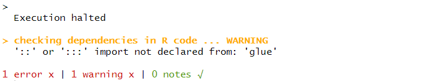

```{r setup, include=FALSE}
knitr::opts_chunk$set(echo = TRUE, eval = FALSE)
```

## A little background

<script async class="speakerdeck-embed" data-id="cd3f287479984f3485bb0bbbc25a0d0f" data-ratio="1.77777777777778" src="//speakerdeck.com/assets/embed.js"></script>
<div style="margin-bottom:5px"> <strong> <a href="https://speakerdeck.com/ntwilliams/making-an-r-package" title="Making an R Package" target="_blank">Making an R Package</a> </strong> from <strong><a href="https://speakerdeck.com/ntwilliams" target="_blank">Nick Williams</a></strong>. </div><br>

## Creating the initial package

To get setup, we can first check to see if the `devtools` package is installed and if not install it. 

```{r eval = FALSE}
if (!require(devtools)) {
  install.packages("devtools") 
  library(devtools)
} else {
  library(devtools)
}
```

Once we have devtools loaded, we can create the skeleton of the package. This is where you get to decide the most important aspect of your package, it's name. 

In this case, we will name our package *foopkg*. To create the package we call `create_packages()` and specify where to create the project for the package on your computer. 

```{r}
create_package("~/Documents/foopkg")
```

I'm creating project in my "Documents" folder on my computer. If you want to save the package in a different folder just modify the filepath. You should get an output similar to this and a new R project should open up. 


If you use version control, now would also be a good time to create a git repository for your new package (I'm not going to here, but you should really do this if working on a real package). *devtools* is nice and has a function to do just this.

```{r}
use_git()
```

Before we go any further, we should also add a license. Making an R package is a lot of work and it is important to take ownership of what you create. An MIT License is the best way to go if you want other people to be able to use your package and its code with the only restriction that any further distribution of the package also includes the license. 

```{r}
use_mit_license("Your name here")
```

Two new files should be added to your package folder. If you open the .md file you should see a license identical to this one but with your name instead. 


## Adding functions

Making a package requires you to have functions within the package to actually use. We won't go over writing functions here, but there are plenty of resources online if you need help. 

The code for package functions should be stored in the R folder. It is good practice to save the file name as the name of the function itself. Once again, *devtools* has a helper function for this. 

```{r}
use_r("fooadd")
```

`use_r()` will create a .R file in R/. In this case, the file will be called "fooadd.R" We can now populate the new file with the defining code of the functions. 

```{r}
fooadd <- function(...) {
  x <- sum(...)
  
  out <- list(vals = unlist(list(...)), sum = x)
  class(out) <- "fadd"
  out
}

print.fadd <- function(x, ...) {
  
  base <- glue::glue('{x$vals[1]} +')
  y <- x$vals[2:length(z$vals)]
  
  for (i in 1L:length(y)) {
    if (i < length(y)) {
      base <- glue::glue('{base} {y[i]} +')
    } else if (i == length(y)) {
      base <- glue::glue('{base} {y[i]}')
    }
  }
  cat(glue::glue('{base} = {x$sum}'))
}
```

`fooadd` is a simple function that takes two integers as its arguments and returns their sum. However, instead of returning standard R console output, we are are going to utilize the S3 object-oriented program mechanic in R to output some nicer looking output. To do this, we write a function called `print.fadd` which takes as its input the list created when calling `fooadd` and then combines those list elements using `glue`. Now, whenever printing the results of `fooadd`, the function `print` searches through its defined methods and recognizes how to print an object of class "fadd". 

This might seem unnecessary, but its important to remember that you should be writing functions that are going to be distributed and used in ways you may not expect. Beyond returning a more user friendly output, creating an S3 method for the generic `print` function allows users to save the results of `fooadd` as an object which can be further manipulated. 

### Experimentation

Of course you are going to want to test your function as you go to make sure its working the way you expect it to. Instead of adding the function to your global environment as you might do in a normal R script you should call `load_all()`. 


If we call this for *foopkg* we can now experiment with `fooadd` in a robust way. 


It looks like our functions are working!

## Documentation

If you're creating functions that you don't intend to be distributed to anyone else you could call the job complete. Publishable packages, however, are distributed with documentation that helps users figure out how to utilize the functions. Good documentation is a cornerstone of a good package. For example, run `?lm`. Help pages such as these are written in an R specific markup language that is similar to LaTeX. 

Instead of writing the bulk of this code by hand, we can use the *roxygen2* package to build a skeleton that needs to be filled in. 

To get started, we can generate the skeleton of our functions' documentation by clicking anywhere within each function and using *Code > Insert Roxygen Skeleton*. 

```{r}
#' Title
#'
#' @param obj
#' @param ...
#'
#' @return
#' @export
#'
#' @examples
fooadd <- function(...) {
  x <- sum(...)

  out <- list(vals = unlist(list(...)), sum = x)
  class(out) <- "fadd"
  out
}

#' Title
#'
#' @param x
#' @param ...
#'
#' @return
#' @export
#'
#' @examples
print.fadd <- function(x, ...) {

  base <- glue::glue('{x$vals[1]} +')
  y <- x$vals[2:length(z$vals)]

  for (i in 1L:length(y)) {
    if (i < length(y)) {
      base <- glue::glue('{base} {y[i]} +')
    } else if (i == length(y)) {
      base <- glue::glue('{base} {y[i]}')
    }
  }
  cat(glue::glue('{base} = {x$sum}'))
}
```

Roxygen comments begin with `#'` and the roxygen comments that proceed a function are called blocks which are separated by `@tags`. 

The first paragrah is the title of the documentation while the second paragraph becomes the description of the function. The third paragraph is the details section that goes into more specific detail about how the function works; this section usually comes after `@param` tags. 

`@param a_paramter` tags describe specific parameters in the function (i.e., whether they are required or optional, their class, etc.). 
`@return` describes what is returned when a function is succesfully run. 
`@examples` is where you should include executable R code as examples of the function in use. 
`@export` indicates to add the function to the NAMESPACE so the function can actually be used. 

Lets populate the tags with the information regarding the functions. 

```{r}
#' fooadd
#'
#' A useless function for adding numbers.
#'
#' @param ... numbers you could sum
#'
#' @return The summation
#' @export
#'
#' @examples
#' fooadd(1, 2, 3, 4)
fooadd <- function(...) {
  x <- sum(...)

  out <- list(vals = unlist(list(...)), sum = x)
  class(out) <- "fadd"
  out
}

#' S3 method for printing fooadd
#'
#' @param x list containing objects to print
#' @param ... optional arguments
#'
#' @return Some pretty output
#' @export
print.fadd <- function(x, ...) {

  base <- glue::glue('{x$vals[1]} +')
  y <- x$vals[2:length(z$vals)]

  for (i in 1L:length(y)) {
    if (i < length(y)) {
      base <- glue::glue('{base} {y[i]} +')
    } else if (i == length(y)) {
      base <- glue::glue('{base} {y[i]}')
    }
  }
  cat(glue::glue('{base} = {x$sum}'))
}
```

We can now generate the files that will contain this documentation by calling `document()`. 


### Namespace & Description

You might have noticed that `fooadd` uses a function from another package, `glue` from *glue*, to create our output. What happens though if a user doesn't already have *glue* installed? 



This is where the NAMESPACE comes into play and it basically ensures that our package plays well with others. *You should not edit the NAMESPACE by hand*.

There are two ways of doing this: imports and depends. 

```{r}
#' foopkg: Lets add some numbers
#'
#' You get one function: add
#'
#' @section The functions:
#' fooadd()
#'
#' @docType package
#' @name foopkg
#' 
#' @import glue
#' 
NULL
#> NULL
```

## Tests

## Check and Install


